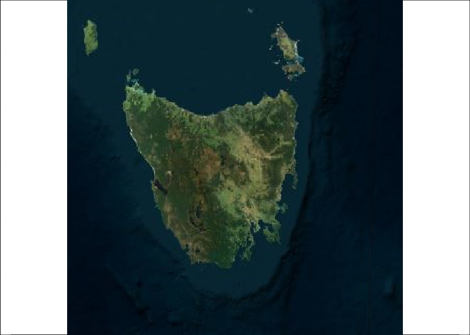
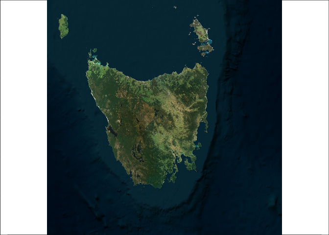

<!-- README.md is generated from README.Rmd. Please edit that file -->

# ximage

<!-- badges: start -->

[](https://github.com/hypertidy/ximage/actions/workflows/R-CMD-check.yaml)
<!-- badges: end -->

The goal of ximage is to make something like ‘image()’ and
‘rasterImage()’ but without the missing functionality and useability.

ximage supports making images from

- numeric, character, byte matrix
- numeric array
- nativeRaster
- list returned from `vapour::gdal_raster_()` functions which include
  numeric, character, byte vectors or nativeRaster

The orientation is in “raster-order”, i.e. when you’re looking at the
picture it’s topleft to topright, then scan lines down each row to the
bottom (like western reading and `par(mfrow)` order). This matches the
way that spatial data readers read imagery.

## Example

This is a basic example which shows you how to solve a common problem:

``` r
library(ximage)
ximage(topo)  ## plot in the index space of the matrix
```


``` r

## or, plot in the geographic space (we happen to know this for this matrix)
ximage(topo, extent = c(-180, 180, -90, 90), axes = F)
axis(1); axis(2);box()
```


``` r
ximage(logo_a)  ## plot a RGB array
#> Warning in matrix(palr::image_pal(x, col, breaks = breaks), dim(x)[1L], : data
#> length differs from size of matrix: [30400 != 76 x 100]
## plot  a native raster over the other in a different window
ximage(logo_n, extent = c(10, 20, 20, 40), add = TRUE)

ximage(topo, extent = c(40, 60, 80, 100), add = TRUE, col = hcl.colors(256))
```


We can get imagery from the internet, and plot it very quickly.

``` r
library(vapour)  ## quite a recent version, dev in January 2024
virtual_earth <-  "<GDAL_WMS><Service name=\"VirtualEarth\"><ServerUrl>http://a${server_num}.ortho.tiles.virtualearth.net/tiles/a${quadkey}.jpeg?g=90</ServerUrl></Service><MaxConnections>4</MaxConnections><Cache/></GDAL_WMS>"
par(mar = rep(0, 4))
px <- dev.size("px")
px[which.min(px)] <- 0

## change lon_0 and lat_0 to anywhere you like
im <- gdal_raster_nara(virtual_earth, target_ext = c(-1, 1, -1, 1) * 3e5, target_dim = px, target_crs = "+proj=laea +lon_0=147 +lat_0=-42")
#> Byte
#> 1

system.time(ximage(im, asp = 1))
```



    #>    user  system elapsed 
    #>   0.006   0.000   0.006


    ## crank up the size it's still fast
    px <- px * 4
    im <- gdal_raster_nara(virtual_earth, target_ext = c(-1, 1, -1, 1) * 3e5, target_dim = px, target_crs = "+proj=laea +lon_0=147 +lat_0=-42")
    #> Byte
    #> 1

    system.time(ximage(im, asp = 1))



    #>    user  system elapsed 
    #>   0.126   0.032   0.159

## Code of Conduct

Please note that the ximage project is released with a [Contributor Code
of
Conduct](https://contributor-covenant.org/version/2/1/CODE_OF_CONDUCT.html).
By contributing to this project, you agree to abide by its terms.
