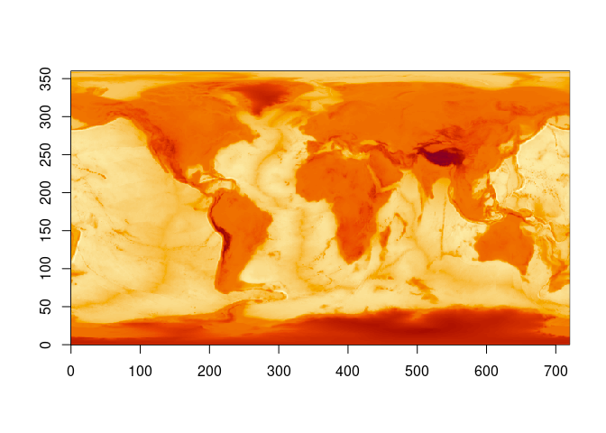
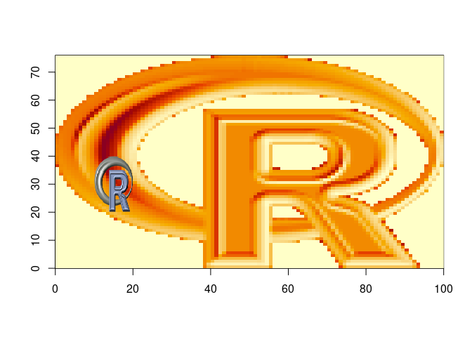

<!-- README.md is generated from README.Rmd. Please edit that file -->

# ximage

<!-- badges: start -->

[](https://github.com/hypertidy/ximage/actions/workflows/R-CMD-check.yaml)
<!-- badges: end -->

VERY VERY WIP

The goal of ximage is to make something like ‘image()’ and
‘rasterImage()’ but without the acquired need for compatibility with
WTAF.

<!--

## Installation

You can install the development version of ximage from [GitHub](https://github.com/) with:

``` r
# install.packages("devtools")
devtools::install_github("hypertidy/ximage")
```
-->

## Example

This is a basic example which shows you how to solve a common problem:

``` r
library(ximage)
ximage(topo)  ## plot in the index space of the matrix
```



``` r
## or, plot in the geographic space (we happen to know this for this matrix)
ximage(topo, extent = c(-180, 180, -90, 90), axes = F)
axis(1); axis(2);box()
```


``` r
ximage(logo_a)  ## plot a RGB array
## plot  a native raster over the other in a different window
ximage(logo_n, extent = c(10, 20, 20, 40), add = TRUE)

ximage(topo, extent = c(40, 60, 80, 100), add = TRUE, col = hcl.colors(256))
```



## Code of Conduct

Please note that the ximage project is released with a [Contributor Code
of
Conduct](https://contributor-covenant.org/version/2/1/CODE_OF_CONDUCT.html).
By contributing to this project, you agree to abide by its terms.
