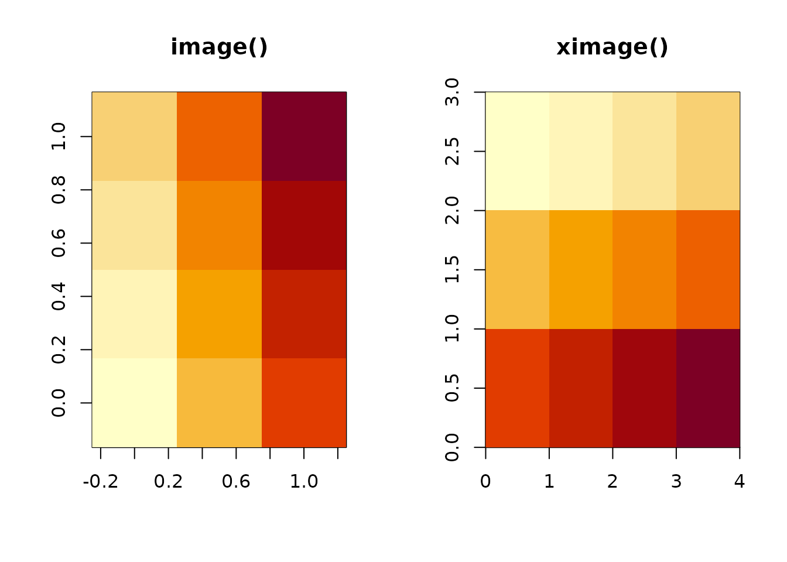
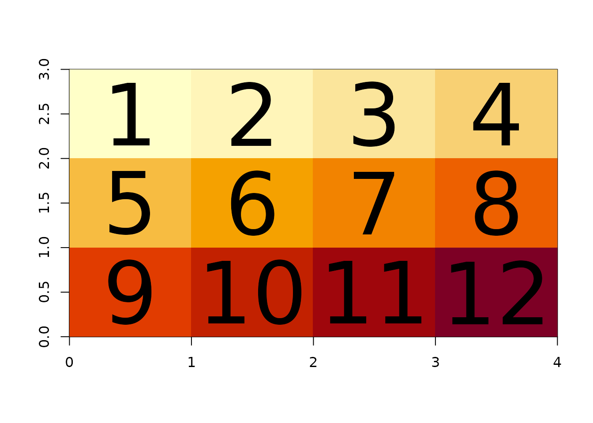
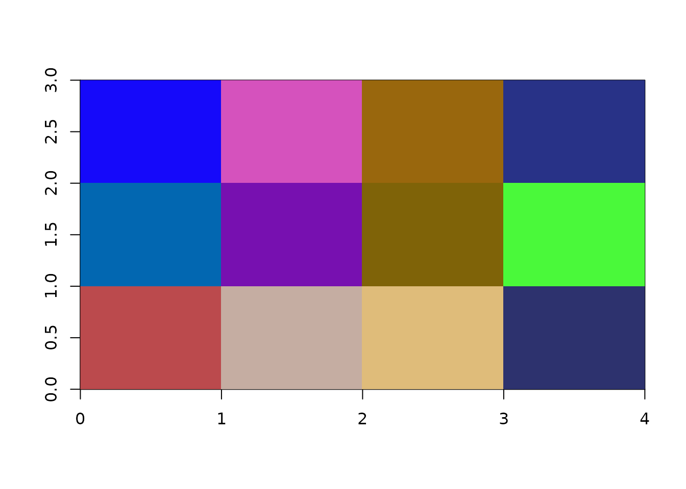
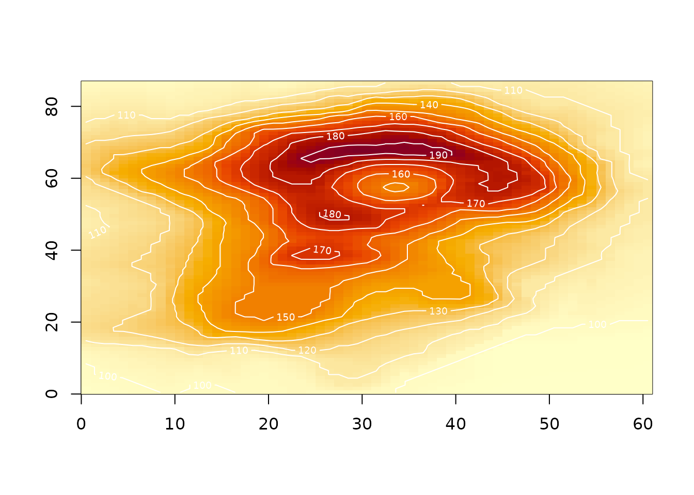

# Array orientation: raster order and the R matrix

``` r

library(ximage)
```

ximage draws data in *raster order*: the first cell of your matrix is
the top-left of the picture, and each row of the matrix is a scan line
reading left to right, down the page. This is the order of western
reading, of `par(mfrow)`, and most image formats and spatial data
readers (GDAL, PNG, JPEG, scan lines).

If you have a stream of pixel values in that order, the R matrix that
ximage expects is

``` r
matrix(values, nrow = <no-of-pixels-in-y-direction>, byrow = TRUE)
```

Note that `nrow` is tied to the length of values, the number of columns
for that matrix is inferred and not required explicitly.

(note that `nrow` here is the number of scan lines, and that R asks for
dimensions as nrow,ncol while image formats declare them as ncol,nrow).
The round trip back to the pixel stream is `as.vector(t(m))`, because
getting values *out* of a matrix is always column-major - there is no
`byrow` for extraction, and none for
[`array()`](https://rdrr.io/r/base/array.html) at all.

## Seeing the layout

[`xtext()`](https://hypertidy.github.io/ximage/reference/xtext.md) draws
the values of a matrix at the centre of each cell, in exactly the layout
[`ximage()`](https://hypertidy.github.io/ximage/reference/ximage.md)
uses. A small labelled matrix makes the convention self-evident.

``` r

(m <- matrix(1:12, nrow = 3, byrow = TRUE))
#>      [,1] [,2] [,3] [,4]
#> [1,]    1    2    3    4
#> [2,]    5    6    7    8
#> [3,]    9   10   11   12

ximage(m)
xtext(m, add = TRUE)
```


Cell `[1, 1]` (value 1) is at the top left. Reading along the top row of
the picture reads along the first row of the matrix: 1, 2, 3, 4. The
default plot space is the *index space* of the matrix, `0,ncol` on x and
`0,nrow` on y, so the picture is `ncol` wide and `nrow` tall and each
cell is 1 x 1.

Note the y axis: row 1 of the matrix is at the *top*, between y = 2 and
y = 3. Axis coordinates increase upward as in any R plot, but row
indices increase downward, as in any image. ximage does not pretend
otherwise, it simply places the first row at the top where an image
expects it.

## What image() does instead

Base [`image()`](https://rdrr.io/r/graphics/image.html) uses a different
convention: the *rows* of the matrix map to the x axis and the *columns*
to the y axis, with the first column at the bottom. The same matrix:

``` r

op <- par(mfrow = c(1, 2))
image(m, main = "image()")
ximage(m, main = "ximage()")
```



``` r

par(op)
```

[`image()`](https://rdrr.io/r/graphics/image.html) has effectively
rotated the data 90 degrees anticlockwise: what you see is the
transpose, flipped. The classic incantation to make
[`image()`](https://rdrr.io/r/graphics/image.html) show a matrix the way
you would print it is

``` r

image(t(m[nrow(m):1, ]))
```

and forgetting one half of that (or applying it twice) is the source of
a whole genre of plotting bugs. With ximage the incantation is
`ximage(m)`.

[`rasterImage()`](https://rdrr.io/r/graphics/rasterImage.html), which
ximage uses underneath, already follows raster order. What it lacks is
everything else: it cannot start a plot, cannot map numeric values
through a palette, and cannot handle missing values. ximage is
raster-order
[`rasterImage()`](https://rdrr.io/r/graphics/rasterImage.html) with
those limitations removed.

## From pixel stream to matrix and back

Spatial readers hand you scan lines: a vector of values in raster order,
with the dimensions declared alongside as (ncol, nrow) - x before y, the
image-format convention. The two conversions are:

``` r

vals <- 1:12                # the pixel stream, raster order
dimension <- c(4L, 3L)      # (ncol, nrow), as a reader declares it

m <- matrix(vals, dimension[2L], byrow = TRUE)
m
#>      [,1] [,2] [,3] [,4]
#> [1,]    1    2    3    4
#> [2,]    5    6    7    8
#> [3,]    9   10   11   12

## and back again
all(as.vector(t(m)) == vals)
#> [1] TRUE
```

[`ximage()`](https://hypertidy.github.io/ximage/reference/ximage.md)
applies this conversion for you when given reader output directly. A
list with `dimension` and `extent` attributes (the vapour convention),
or a vector or list with a `gis` attribute (the gdalraster convention),
plots correctly with no handling at all:

``` r

l <- structure(list(vals), dimension = dimension, extent = c(0, 4, 0, 3))
ximage(l)
xtext(l, add = TRUE)
```



The rule inside ximage is simple: if the dimensions arrived as an
*attribute*, the data is a raster-order stream and gets the `byrow`
treatment; a bare R matrix is taken to be already oriented. That is why
`ximage(list(volcano))` and `ximage(volcano)` are identical, while
reader output - even when a reader has pre-shaped it into a matrix - is
reassembled from the stream.

## Multi-band arrays

There is no `byrow` for [`array()`](https://rdrr.io/r/base/array.html),
so a raster-order stream of RGB bands needs one more step.
Band-sequential data (all of band 1, then band 2, then band 3, which is
what GDAL readers return) becomes a display-ready array with:

``` r

nbands <- 3L
stream <- runif(prod(dimension) * nbands)

a <- aperm(array(stream, c(dimension[1:2], nbands)), c(2, 1, 3))
dim(a)  ## (nrow, ncol, nbands)
#> [1] 3 4 3
ximage(a)
```



The [`array()`](https://rdrr.io/r/base/array.html) call shapes each band
as (ncol, nrow) - filled column-major, so each *column* holds a scan
line - and the [`aperm()`](https://rdrr.io/r/base/aperm.html) swaps the
first two dimensions to give R display orientation. Again, ximage does
this for you when the bands come as a reader-output list; the recipe is
shown for when you meet a raw stream.

## Extent: cells have edges

The `extent` argument (xmin, xmax, ymin, ymax) declares the *outer
edges* of the data, not the centres of the corner cells. The default
index-space extent `c(0, ncol, 0, nrow)` follows the same rule: cell
`[1, 1]` spans x from 0 to 1 and y from nrow - 1 to nrow, and its
centre - where
[`xtext()`](https://hypertidy.github.io/ximage/reference/xtext.md) puts
the label - is at (0.5, nrow - 0.5).

``` r

ximage(m, extent = c(140, 148, -44, -38))
xtext(m, extent = c(140, 148, -44, -38), add = TRUE)
axis(1); axis(2)
abline(v = seq(140, 148, by = 2), h = seq(-44, -38, by = 2), lty = 3)
```


This edge convention is shared by GDAL geotransforms and by
[`rasterImage()`](https://rdrr.io/r/graphics/rasterImage.html), and it
is what makes images from different sources overlay exactly: an extent
is a statement about where the data sits, not about where its first
sample was taken.
[`xcontour()`](https://hypertidy.github.io/ximage/reference/xcontour.md)
uses the matching cell-centre positions, so contour lines and image
cells register correctly:

``` r

ximage(volcano)
xcontour(volcano, add = TRUE, col = "white")
```



## Summary

- ximage displays matrices in raster order: first cell top-left, rows
  are scan lines.
- Stream to matrix: `matrix(vals, nrow, byrow = TRUE)`. Matrix to
  stream: `as.vector(t(m))`.
- Reader dimensions are (ncol, nrow); R dimensions are (nrow, ncol).
- Multi-band streams:
  `aperm(array(vals, c(ncol, nrow, nbands)), c(2, 1, 3))`.
- `extent` declares cell edges, cell centres sit half a cell in.
- ximage applies all of this automatically for vapour and gdalraster
  output; the recipes are here for everything else.
